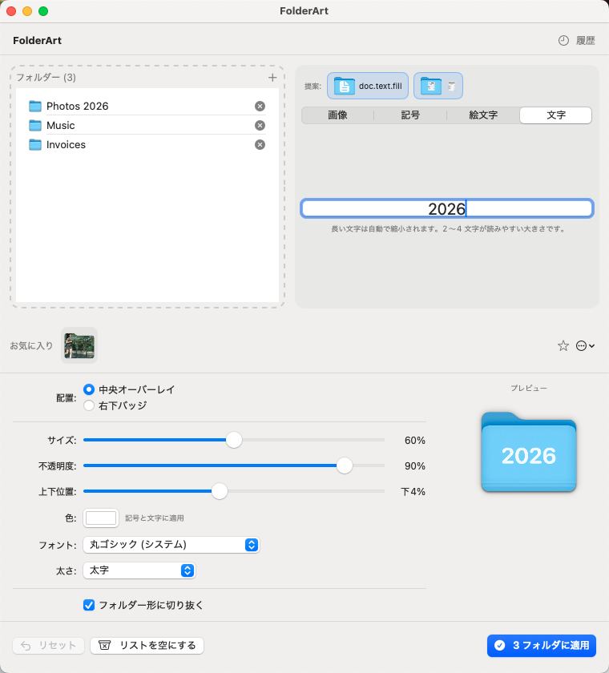

# FolderArt

<p align="center">
  <!-- License -->
  <a href="LICENSE">
    
  </a>
  <!-- Latest release -->
  <a href="https://github.com/annrie/FolderArt/releases/latest">
    
  </a>
  <!-- Downloads total -->
  <a href="https://github.com/annrie/FolderArt/releases">
    
  </a>
  <!-- Downloads latest release -->
  <a href="https://github.com/annrie/FolderArt/releases/latest">
    
  </a>
  <!-- Stars -->
  <a href="https://github.com/annrie/FolderArt/stargazers">
    
  </a>
</p>

<p align="center">
  <a href="#english">English</a> | <a href="#日本語">日本語</a>
</p>

<p align="center">
  
</p>

---

## English

A macOS app that changes folder icons by compositing a custom image onto the standard folder icon.

### Features

- Overlay sources: image, SF Symbols (restricted symbols excluded), emoji, text
- Tint color for symbols and text
- Font and weight for text: eight fonts bundled with macOS and six weights (weight also applies to symbols)
- Presets: save a look and restore it in one click
- Batch apply to many folders; select rows to re-apply to a subset
- Suggestions from the folder name and contents: up to four symbol / emoji / text / preset candidates above the tabs, plus a symbol / emoji for the dominant file kind (images, videos, documents, e-books, fonts, 3D models, and more) and a representative image when images dominate; tuned to reduce false positives, prefer whole-name matches, and match dictionary keys in all eight languages. Add your own words with the in-app editor (File > Edit Suggestion Dictionary…) or by hand-editing `suggestions-user.json`
- Preset packs (`.folderartpack`): export and import all presets as one file; double-click to import. Partial export from the … menu
- Hover the preview to enlarge it and see 16/32/64/128px renderings
- Drag & drop (multiple folders, images anywhere in the window)
- Position, size, opacity, vertical offset, clip to folder shape
- Icons are composited at multiple resolutions, staying crisp even at small sizes (16/32px, etc.)
- Backup, reset, history
- Eight languages (Japanese, English, German, Spanish, French, Korean, Brazilian Portuguese, Traditional Chinese) and a View > Language menu
- Finder right-click Quick Actions (Open in FolderArt / Apply Last Preset in FolderArt / Reset Icon in FolderArt), with names localized into eight languages

> **Note:** SF Symbols are rendered via macOS's runtime API, so no image files are bundled with the app. Restricted symbols that represent Apple products or features are excluded from the picker.

### Requirements

| Item | Requirement |
|------|------|
| OS | macOS 13 Ventura or later |
| Architecture | Apple Silicon / Intel |
| Xcode | 15 or later (for building) |

### Installation

#### Use the prebuilt .app

1. Download `FolderArt.app`
2. Move it to the `/Applications` folder
3. For the first launch, **right-click → Open → "Open"**

> **Note:** Notarization is not yet supported, so the right-click launch is needed only the first time.

#### Build from source

```bash
# Dependencies
brew install xcodegen

# Clone the repo
git clone https://github.com/annrie/FolderArt.git
cd FolderArt

# Generate the project
xcodegen generate

# Build (Debug)
xcodebuild build -scheme FolderArt -destination 'platform=macOS'

# Test
xcodebuild test -scheme FolderArt -destination 'platform=macOS'
```

### Usage

1. Add folders to the list: drop them on the left list, or pick several with the + button
2. Choose what to overlay: the image, symbol, emoji, or text tab on the right
3. Adjust position, size, opacity, vertical offset, tint and weight (symbols and text), and font (text). Turn on "clip to folder shape" to trim the overlay to the folder outline. The vertical position defaults to 4% down, the visual center of the folder body
4. Check the preview: it updates as you go, and hovering enlarges it and shows 16/32/64/128px renderings
5. Apply: the button applies to every folder in the list, or only to the rows you selected
6. Presets: save the current look (overlay + settings) with +, and restore it by clicking its chip. Use "Export Selected…" in the … menu to pack only some presets
7. Reset: restores the icons FolderArt applied; folders it never touched are left alone
8. History: re-apply or reset a past application from the History sheet in the toolbar
9. Language: pick one of eight languages from View > Language in the menu bar (takes effect after a restart)

> **Note:** A hand-written pack without a vertical position gets the default (4% down).

### Customizing suggestions

**In-app editor (recommended):** File > Edit Suggestion Dictionary… opens a dedicated window to add, edit, and delete entries — pick an entry on the left, add/remove its keys on the right, choose a symbol from the search grid and an emoji in the field, then Save (it validates before writing and the app's suggestions update automatically).

Hand-editing still works: File > Open Suggestion Dictionary… reveals `suggestions-user.json` (Application Support/FolderArt) in the Finder, creating it with one example if needed. It uses the bundled dictionary's format and is reloaded automatically when saved (you are told if it is broken). Your entries win over bundled ones for the same word.

```json
[
  {"keys": ["案件", "project"], "symbol": "folder.fill.badge.gearshape", "emoji": "🗂️"},
  {"keys": ["請求書"], "emoji": "🧾"}
]
```

### Quick Actions

Right-click a folder in the Finder to find these three items in the services menu.

- **Open in FolderArt**: adds the selected folders to FolderArt's list and brings the app forward
- **Apply Last Preset in FolderArt**: applies the preset you used most recently, without opening FolderArt
- **Reset Icon in FolderArt**: resets icons FolderArt applied, without opening FolderArt

All three names start with "… in FolderArt" because the right-click Quick Actions list is flat (not grouped by app), so the name alone shows which app a given action belongs to. The names are localized into eight languages via `ServicesMenu.strings` and follow the app's language.

"Apply Last Preset in FolderArt" and "Reset Icon in FolderArt" run silently — the changed folder icon in the Finder is the confirmation (FolderArt only comes forward to show a message if something fails). "Open in FolderArt" always brings the app forward.

If the items don't appear, put `FolderArt.app` in `/Applications` or `~/Applications` and launch it once, then check that they're enabled under **System Settings > Keyboard > Keyboard Shortcuts > Services**.

### Project structure

```
FolderArt/
├── AppDelegate.swift           # Owns the shared AppModel, registers NSServices, decides silent-quit behavior
├── AppModel.swift              # Aggregates the whole screen's state
├── ContentView.swift           # Assembles the main screen
├── FolderArtApp.swift          # App entry point
├── Models/
│   ├── CodableColor.swift      # sRGB color and font weight that can be saved to JSON
│   ├── CompositionSettings.swift # Composition settings (placement, size, color, font, etc.)
│   ├── IconTask.swift          # One history entry (including migration from v1)
│   ├── Overlay.swift           # What gets overlaid (image / symbol / emoji / text)
│   ├── Pack.swift              # Preset pack format
│   ├── Preset.swift            # A preset (overlay + settings)
│   ├── PresetExportSelection.swift # Selection state for "Export Selected"
│   └── Suggestion.swift        # One suggestion (symbol / emoji / text / preset / representative image)
├── Services/
│   ├── AppLanguage.swift       # Language menu selection and persistence to AppleLanguages
│   ├── ApplyCoordinator.swift  # Batch apply and reset across multiple folders
│   ├── BitmapCanvas.swift      # Drawing helpers for sRGB bitmaps
│   ├── BookmarkManager.swift   # Security-Scoped Bookmark management
│   ├── ContentScanner.swift    # Detects dominant file kind and representative image in a folder
│   ├── FileIdentity.swift      # Folder identity (volume UUID + inode)
│   ├── FileWatcher.swift       # Watches the user dictionary (directory + file)
│   ├── FolderIconManager.swift # NSWorkspace icon operations and backups
│   ├── FontCatalog.swift       # Curated fonts and family + weight resolution
│   ├── IconComposer.swift      # Compositing onto the standard folder icon
│   ├── MaintenanceSweep.swift  # Startup cleanup (unreferenced backups, quarantined files)
│   ├── OverlayRenderer.swift   # Renders the four overlay kinds into a square image
│   ├── PackReader.swift        # Pack loading and validation
│   ├── PackWriter.swift        # Pack export
│   ├── PresetImporter.swift    # Imports presets from a pack
│   ├── QuickActionProvider.swift # NSServices provider object (thin delegation from pboard to AppModel)
│   ├── SuggestionDictionary.swift # Loads the suggestion dictionary (suggestions.json + suggestions-user.json)
│   ├── SuggestionEngine.swift  # Suggestions from the folder name and contents
│   └── SymbolCatalog.swift     # SF Symbols catalog (restricted symbols excluded)
├── State/
│   ├── FolderSelection.swift   # List and selection of target folders
│   └── OverlayState.swift      # Overlay, settings, and preview state
├── Stores/
│   ├── AssetStore.swift        # Duplicates and reclaims images as 512px PNGs
│   ├── CodableStore.swift      # JSON read/write and quarantining of corrupted files
│   ├── HistoryStore.swift      # Application history
│   ├── LastPresetStore.swift   # Persists the id of the most recently used preset
│   └── PresetStore.swift       # Presets
├── Views/
│   ├── ControlsView.swift      # Setting sliders and color
│   ├── DropZoneView.swift      # Drag & drop zone (AppKit implementation)
│   ├── FolderListView.swift    # List of target folders
│   ├── HistoryView.swift       # History sheet
│   ├── OverlayPickerView.swift # The four-tab picker screen
│   ├── PresetExportPickerView.swift # "Export Selected" popover
│   ├── PresetStripView.swift   # Row of preset chips
│   ├── PreviewView.swift       # Preview and hover magnification
│   ├── SuggestionStripView.swift # Row of suggestion chips
│   └── SymbolGridView.swift    # Symbol search and grid
└── Resources/
    ├── InfoPlist.xcstrings     # Document type names (8 languages, generated)
    ├── Localizable.xcstrings   # UI strings (8 languages, generated)
    ├── ServicesMenu.xcstrings  # Quick Action names (8 languages, generated → each .lproj/ServicesMenu.strings)
    ├── restricted-symbols.txt  # Bundled fallback list of restricted symbols
    └── suggestions.json        # Suggestion dictionary (word → symbol/emoji)
scripts/localization/
├── strings.json                # Source strings (key → 8 languages)
├── infoplist.json              # Strings for InfoPlist
├── servicesmenu.json           # Quick Action name strings
├── build-xcstrings.py          # Generates .xcstrings and cross-checks against the source (--check / --stringsdata, detects specifier type mismatches)
└── check-compiled.sh           # Strict comparison against compiler-extracted keys
```

### Technical details

- Swift 5.9 + SwiftUI + AppKit (macOS 13+)
- App Sandbox support, persisting folder access with Security-Scoped Bookmarks
- High-quality image compositing with Core Graphics / NSBitmapImageRep
- Folder-shape clipping via `NSCompositingOperation.destinationIn`
- Reliable drag & drop with AppKit's `NSDraggingDestination`
- Eight-language support via String Catalog, generated from `scripts/localization/strings.json`

### License

MIT License

### Author

[@annrie](https://github.com/annrie)

---

## 日本語

macOS のフォルダーアイコンにカスタム画像を合成してアイコンを変更するアプリです。

### 機能

- 重ねるものを 4 種類から選択: 画像 / SF Symbols (制限付き記号は除外) / 絵文字 / 文字
- 記号と文字の色を指定
- 文字のフォントと太さ: macOS 同梱の 8 種のフォントと 6 段階の太さ (太さは記号にも効く)
- お気に入り: 見た目 (オーバーレイ + 設定) を保存し 1 クリックで復元
- 複数フォルダへの一括適用、行を選べば一部だけに再適用
- フォルダ名と中身からの自動提案: 記号・絵文字・文字・お気に入りの候補をタブの上に最大 4 つ表示。直下のファイルの種類 (画像・動画・書類・電子書籍・フォント・3D モデルなど) に合う記号・絵文字と、画像が多ければ代表画像。誤検出を抑え、名前まるごと一致を優先し、辞書は 8 言語のキーに対応。自分の辞書で語を足せる: アプリ内エディタ (ファイル > 提案辞書を編集…) か `suggestions-user.json` の手編集
- お気に入りパック (`.folderartpack`): お気に入りを 1 ファイルで書き出し・読み込み、ダブルクリックで取り込み。一部だけの書き出しも可
- プレビューに hover で拡大表示と 16/32/64/128px の実寸
- ドラッグ&ドロップ (複数フォルダ、ウィンドウ任意位置への画像)
- 位置・サイズ・不透明度・上下位置・フォルダ形切り抜き
- 複数解像度でアイコンを合成し、小さな表示 (16/32px など) でも鮮明
- バックアップ、リセット、履歴
- 8 言語対応 (日本語・英語・ドイツ語・スペイン語・フランス語・韓国語・ポルトガル語 (ブラジル)・繁体字中国語) と「表示 > 言語」メニュー
- Finder の右クリックからクイックアクション (FolderArt で開く / FolderArt で直前のお気に入りを適用 / FolderArt でアイコンを元に戻す)、表示名は 8 言語に対応

> **Note:** SF Symbols は macOS の実行時 API で描画しており、画像ファイルは同梱していません。Apple 製品や機能を表す制限付き記号は選択肢から除外しています。

### 動作環境

| 項目 | 要件 |
|------|------|
| OS | macOS 13 Ventura 以降 |
| アーキテクチャ | Apple Silicon / Intel |
| Xcode | 15 以上（ビルド時） |

### インストール

#### ビルド済み .app を使う

1. `FolderArt.app` をダウンロード
2. `/Applications` フォルダーへ移動
3. 初回起動は **右クリック → 開く → 「開く」** で起動

> **Note:** 現時点では Notarize 未対応のため、初回のみ右クリックからの起動が必要です。

#### ソースからビルドする

```bash
# 依存ツール
brew install xcodegen

# リポジトリを取得
git clone https://github.com/annrie/FolderArt.git
cd FolderArt

# プロジェクト生成
xcodegen generate

# ビルド（Debug）
xcodebuild build -scheme FolderArt -destination 'platform=macOS'

# テスト
xcodebuild test -scheme FolderArt -destination 'platform=macOS'
```

### 使い方

1. **フォルダーをリストに追加** — 左のリストにフォルダーをドロップ（「＋」から複数選択も可）
2. **重ねるものを選ぶ** — 右の 4 タブから 画像 / 記号 / 絵文字 / 文字 を選択
3. **設定を調整** — 配置・大きさ・不透明度・上下位置、記号と文字は色と太さ、文字はフォントも。**フォルダー形に切り抜く** を ON にすると、はみ出した部分をフォルダーの形で切り落とす。上下位置の既定は「下4%」(蓋つきのフォルダー本体の見た目の中心)
4. **プレビューを確認** — 合成結果はその場で更新。プレビューに hover すると拡大表示と 16/32/64/128px の実寸が出る
5. **適用** — 「N フォルダに適用」ボタン。リストで行を選んでいれば、その行だけに適用する
6. **お気に入り** — 「＋」で今の見た目（重ねるもの + 設定）を保存し、チップをクリックで復元。「…」の「選んで書き出す…」で一部だけをパックにできる
7. **元に戻す** — 「リセット」で適用先のアイコンを戻す。FolderArt が適用していないフォルダーには触らない
8. **履歴** — ツールバーの「履歴」から、過去の適用を再適用したり、リセットしたりできる
9. **言語** — メニューバーの「表示 > 言語」から 8 言語を選べる (再起動で反映)

> **Note:** 欄の無い手書きのパックの上下位置は既定 (下4%) になります。

### 提案辞書のカスタマイズ

**アプリ内エディタ (おすすめ):** 「ファイル > 提案辞書を編集…」で専用ウィンドウを開き、項目の追加・編集・削除ができます。左の一覧で項目を選び、右でキー (語) を足し引きし、記号は検索グリッドから、絵文字は入力欄から選びます。「保存」で検証してから書き出し、本体の提案に自動で反映されます。

手編集も可能です。「ファイル > 提案辞書を開く…」で `suggestions-user.json` (Application Support/FolderArt) を Finder に表示します。無ければ例を 1 件入れて作ります。形式は同梱の辞書と同じで、保存すると自動で反映されます (壊れていれば知らせます)。同じ語が同梱辞書にもあれば自分の辞書が優先されます。

```json
[
  {"keys": ["案件", "project"], "symbol": "folder.fill.badge.gearshape", "emoji": "🗂️"},
  {"keys": ["請求書"], "emoji": "🧾"}
]
```

### クイックアクション

Finder でフォルダーを右クリックすると、次の 3 つがサービスメニューに追加されます。

- **FolderArt で開く** — 選んだフォルダーを FolderArt のリストに追加し、アプリを前面化する
- **FolderArt で直前のお気に入りを適用** — FolderArt を開かずに、直前に使ったお気に入りをそのまま適用する
- **FolderArt でアイコンを元に戻す** — FolderArt が付けたアイコンだけを、開かずに元に戻す

3 つとも表示名が「FolderArt で〜」で始まるのは、右クリックのクイックアクション欄はアプリ別にまとまらず平坦に並ぶため、どのアプリの機能かひと目で分かるようにするためです。表示名は `ServicesMenu.strings` により 8 言語にローカライズされ、アプリの言語に追従します。

「FolderArt で直前のお気に入りを適用」と「FolderArt でアイコンを元に戻す」は静かに実行され、Finder 上でアイコンが変わることが完了の合図です (エラー時のみ FolderArt が前面に出てメッセージを出します)。「FolderArt で開く」は常にアプリを前面化します。

項目が出ない場合は、`FolderArt.app` を `/Applications` か `~/アプリケーション` に置いて一度起動してから、**システム設定 > キーボード > キーボードショートカット > サービス** で有効になっているか確認してください。

### プロジェクト構成

```
FolderArt/
├── AppDelegate.swift           # 共有 AppModel の所有と NSServices の登録、静かな終了の判定
├── AppModel.swift              # 画面全体の状態を束ねる
├── ContentView.swift           # メイン画面の組み立て
├── FolderArtApp.swift          # アプリのエントリポイント
├── Models/
│   ├── CodableColor.swift      # JSON に保存できる sRGB 色・フォント太さ
│   ├── CompositionSettings.swift # 合成設定（配置・大きさ・色・フォントなど）
│   ├── IconTask.swift          # 履歴 1 行（v1 からの移行を含む）
│   ├── Overlay.swift           # 重ねるもの（画像 / 記号 / 絵文字 / 文字）
│   ├── Pack.swift              # お気に入りパックの形式
│   ├── Preset.swift            # お気に入り（重ねるもの + 設定）
│   ├── PresetExportSelection.swift # 「選んで書き出す」の選択状態
│   └── Suggestion.swift        # 提案 1 つ（記号 / 絵文字 / 文字 / お気に入り / 代表画像）
├── Services/
│   ├── AppLanguage.swift       # 言語メニューの選択と AppleLanguages への保存
│   ├── ApplyCoordinator.swift  # 複数フォルダへの一括適用とリセット
│   ├── BitmapCanvas.swift      # sRGB ビットマップへの描画ヘルパ
│   ├── BookmarkManager.swift   # Security-Scoped Bookmark 管理
│   ├── ContentScanner.swift    # フォルダ直下の種類と代表画像
│   ├── FileIdentity.swift      # フォルダの同一性（ボリューム UUID + inode）
│   ├── FileWatcher.swift       # ユーザー辞書の監視 (ディレクトリ + ファイル)
│   ├── FolderIconManager.swift # NSWorkspace アイコン操作・バックアップ
│   ├── FontCatalog.swift       # 厳選フォントと家族 + 太さの解決
│   ├── IconComposer.swift      # 標準フォルダーアイコンとの合成
│   ├── MaintenanceSweep.swift  # 起動時の掃除（未参照のバックアップ・隔離ファイル）
│   ├── OverlayRenderer.swift   # 4 種類を正方形画像に描画
│   ├── PackReader.swift        # パックの読み込みと検証
│   ├── PackWriter.swift        # パックの書き出し
│   ├── PresetImporter.swift    # パックからお気に入りへの取り込み
│   ├── QuickActionProvider.swift # NSServices の提供オブジェクト (pboard → AppModel への薄い委譲)
│   ├── SuggestionDictionary.swift # 提案辞書（suggestions.json + suggestions-user.json）の読み込み
│   ├── SuggestionEngine.swift  # フォルダ名と中身からの提案
│   └── SymbolCatalog.swift     # SF Symbols のカタログ（制限付きは除外）
├── State/
│   ├── FolderSelection.swift   # 適用先フォルダのリストと選択
│   └── OverlayState.swift      # 重ねるものと設定・プレビュー
├── Stores/
│   ├── AssetStore.swift        # 画像を 512px PNG で複製・回収
│   ├── CodableStore.swift      # JSON の読み書き・破損ファイルの退避
│   ├── HistoryStore.swift      # 適用履歴
│   ├── LastPresetStore.swift   # 直前に使ったお気に入りの id を永続化
│   └── PresetStore.swift       # お気に入り
├── Views/
│   ├── ControlsView.swift      # 設定スライダーと色
│   ├── DropZoneView.swift      # D&D ゾーン（AppKit 実装）
│   ├── FolderListView.swift    # 適用先フォルダのリスト
│   ├── HistoryView.swift       # 履歴シート
│   ├── OverlayPickerView.swift # 4 タブの選択画面
│   ├── PresetExportPickerView.swift # 「選んで書き出す」の popover
│   ├── PresetStripView.swift   # お気に入りのチップ列
│   ├── PreviewView.swift       # プレビューと hover 拡大
│   ├── SuggestionStripView.swift # 提案のチップ列
│   └── SymbolGridView.swift    # 記号の検索とグリッド
└── Resources/
    ├── InfoPlist.xcstrings     # 書類の種類名 (8 言語、生成物)
    ├── Localizable.xcstrings   # UI の文言 (8 言語、生成物)
    ├── ServicesMenu.xcstrings  # クイックアクション名 (8 言語、生成物 → 各 .lproj/ServicesMenu.strings)
    ├── restricted-symbols.txt  # 制限付き記号の同梱 fallback
    └── suggestions.json        # 提案辞書（語 → 記号・絵文字）
scripts/localization/
├── strings.json                # 文言の元 (キー → 8 言語)
├── infoplist.json              # InfoPlist 用の文言
├── servicesmenu.json           # クイックアクション名の文言
├── build-xcstrings.py          # .xcstrings の生成と、ソースとの突き合わせ (--check / --stringsdata、指定子の型不一致検出つき)
└── check-compiled.sh           # コンパイラ抽出のキーとの厳密照合
```

### 技術詳細

- **Swift 5.9 + SwiftUI + AppKit**（macOS 13+）
- **App Sandbox** 対応（Security-Scoped Bookmark でフォルダーアクセスを永続化）
- **Core Graphics / NSBitmapImageRep** による高品質な画像合成
- `NSCompositingOperation.destinationIn` でフォルダー形状クリッピング
- AppKit `NSDraggingDestination` による信頼性の高いドラッグ＆ドロップ
- **String Catalog** による 8 言語対応 (`scripts/localization/strings.json` から生成)

### ライセンス

MIT License

### 作者

[@annrie](https://github.com/annrie)
